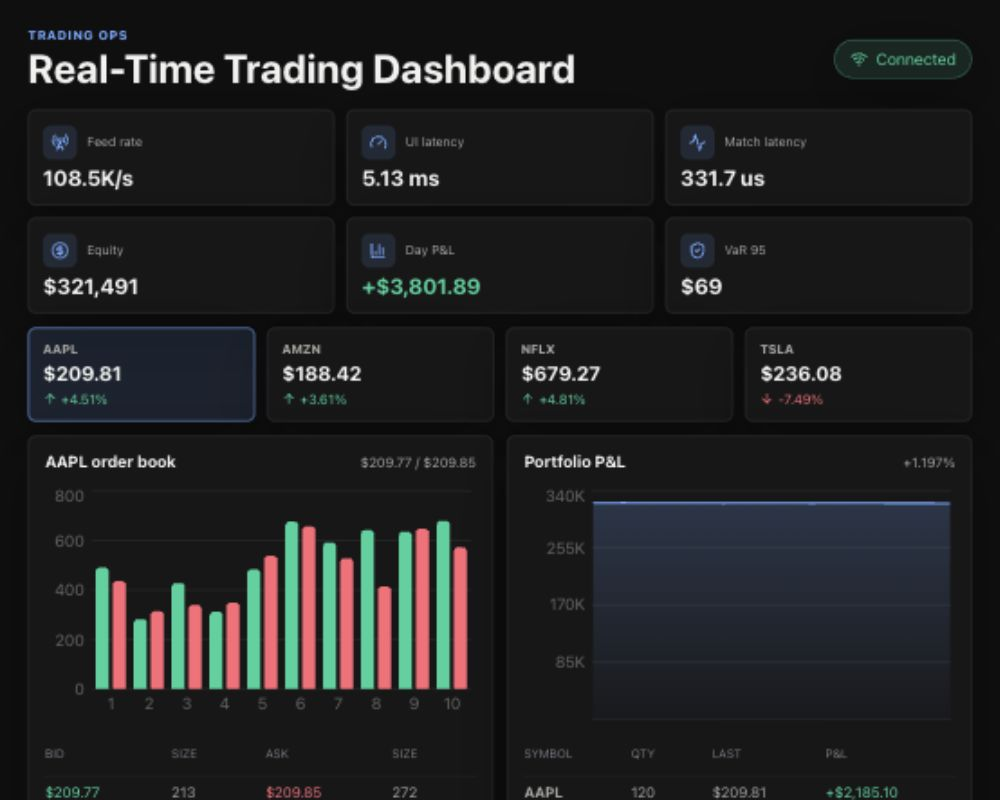

# Real-Time Trading Dashboard

A full-stack trading dashboard that shows live-changing market data, an order book, order entry, portfolio P&L, fills, open orders, and risk metrics.



This project is built to be easy to run locally. It does not need Kafka, Redis, PostgreSQL, or a paid market-data API to demo.

## What Is Real

- The frontend is a real React/TypeScript app.
- The backend is a real FastAPI service.
- The dashboard receives updates through a WebSocket.
- Market and limit orders are sent to the backend through an API.
- Orders update positions, cash, fills, P&L, and risk metrics.
- Risk checks can reject unsafe orders.

## What Is Simulated

- Stock prices are generated by the backend simulator.
- The order book is generated in memory.
- The 100K+ events/sec feed metric is simulated.
- Data is not saved to a database yet.
- Kafka, Redis TimeSeries, and PostgreSQL are planned production upgrades, not required for this MVP.

## Features

- Live symbol prices for AAPL, AMZN, NFLX, and TSLA
- Bid/ask order book with depth chart
- Market and limit order ticket
- Recent fills and open orders
- Portfolio equity and live P&L
- Risk metrics such as VaR, Sharpe ratio, drawdown, exposure, and buying power
- Responsive dashboard layout for desktop and mobile

## Tech Stack

- Frontend: React, TypeScript, Vite, Recharts, lucide-react
- Backend: Python, FastAPI, WebSocket, Pydantic
- Current storage: in-memory Python objects
- Future storage: PostgreSQL for orders/fills/positions, Redis TimeSeries for fast rolling metrics
- Future event pipeline: Kafka for market events and order commands

## How To Run

Open one terminal for the backend:

```bash
cd /Users/venkatasai/real-time-trading-dashboard/backend
python3 -m venv ../.venv
source ../.venv/bin/activate
pip install -r requirements.txt
uvicorn app.main:app --reload --port 8000
```

Open a second terminal for the frontend:

```bash
cd /Users/venkatasai/real-time-trading-dashboard/frontend
npm install
npm run dev
```

Then open:

```text
http://localhost:5173
```

## How To Use It

1. Pick a symbol from the symbol row.
2. Watch the order book and portfolio update live.
3. Choose Buy or Sell in the order ticket.
4. Select Market or Limit.
5. Enter a quantity.
6. Submit the order.
7. Check recent fills, open orders, P&L, and risk metrics.

## Run Tests

Backend tests:

```bash
cd /Users/venkatasai/real-time-trading-dashboard/backend
source ../.venv/bin/activate
pytest
```

Frontend checks:

```bash
cd /Users/venkatasai/real-time-trading-dashboard/frontend
npm run lint
npm run build
```

## Important Files

- `backend/app/main.py`: FastAPI routes and WebSocket endpoint
- `backend/app/simulator.py`: market simulator, order matching, P&L, and risk logic
- `backend/app/models.py`: API request models
- `frontend/src/App.tsx`: main dashboard UI
- `frontend/src/hooks/useMarketStream.ts`: WebSocket connection from frontend to backend
- `frontend/src/types.ts`: shared frontend data types

## How To Explain This Project

Short version:

> Built a real-time trading dashboard with FastAPI and React that streams simulated market data over WebSockets, supports market and limit orders, updates portfolio P&L, and calculates risk metrics in real time.

More technical version:

> Built a local trading-system MVP with a FastAPI WebSocket backend, an in-memory market simulator, deterministic order handling, idempotent client order IDs, live portfolio accounting, and a React/TypeScript dashboard for order book depth, P&L, fills, open orders, and risk monitoring.

## Next Improvements

- Add PostgreSQL persistence for accounts, orders, fills, and positions
- Add Redis TimeSeries for fast P&L and latency history
- Add Kafka topics for market data and order commands
- Add user login and account-level portfolio isolation
- Add historical replay and backtesting mode
- Add Docker Compose for one-command startup
